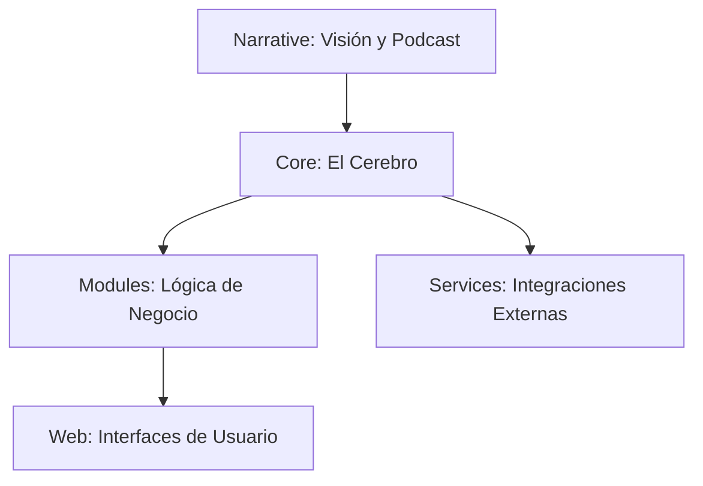

# Guía de Integración: CastFer ERP ➡️ NotebookLM

NotebookLM es una herramienta potente, pero su interfaz de carga es de "archivos planos". Aquí tienes la mejor estrategia para que el agente entienda tu estructura perfectamente.

## 🚀 Cómo subir los archivos (Truco Pro)
Aunque no puedas subir la carpeta principal, puedes subir todos los archivos de golpe:
1. Abre el diálogo de carga en NotebookLM (**+ Add source** > **Local Files**).
2. Entra en tu carpeta `.docs/mirrors/`.
3. Usa la búsqueda de Windows (arriba a la derecha) y escribe `*.md`.
4. Windows te mostrará **todos** los archivos de documentación de todas las subcarpetas.
5. Presiona `Ctrl + A` para seleccionarlos todos y pulsa **Abrir**.
6. NotebookLM los procesará individualmente (estás dentro del límite de 50 fuentes).

## 🗺️ Mapa del Sistema (Para el Agente)
He creado los documentos con nombres descriptivos para que la IA los relacione, pero aquí tienes el esquema mental que debes darle (o que ella leerá en `walkthrough.md`):

### Jerarquía de Referencia:
- **Nivel 1 (Operativo):** `Core/Main.md` y `Core/HeaderManager.md` (Controlan todo).
- **Nivel 2 (Funcional):** `Modules/Inventory.md`, `Modules/Images_IA_Engine.md`, etc.
- **Nivel 3 (Visual):** `Web/Images_Experience.md`, `Web/Pos_View.md`.
- **Nivel 4 (Narrativo):** `Narrative/Brand_Story.md` (Este es el que hace que el Podcast suene increíble).

## 💡 Recomendación para el Podcast (Audio Overview)
Una vez subidos todos, pídele a NotebookLM lo siguiente:
> *"Basándote en los documentos de la carpeta 'Narrative' y el 'Images_IA_Engine', genera un Audio Overview que destaque cómo este ERP no es solo una herramienta administrativa, sino una revolución creativa para el comerciante, enfocándote en la historia del fundador y la visión de futuro."*

¡Esto forzará a la IA a usar el contexto emocional que acabamos de documentar!
