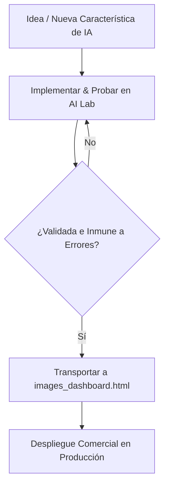

# Arquitectura y Workflow de Desarrollo para Inteligencia Artificial (Gemma 4)

Este documento sirve como hoja de ruta y especificación de diseño arquitectónico para la evolución, refactorización y flujo de trabajo de la Inteligencia Artificial dentro del ecosistema de ERP y Catálogo Publicitario.

---

## 1. Separación de Responsabilidades (Back-end)

El núcleo de la inteligencia artificial y el procesamiento operativo de imágenes se dividen en dos capas bien diferenciadas:

### A. Capa Operativa y Administrativa (`src/Modules/Images.js`)
* **Rol:** Administrador físico de recursos y orquestador de base de datos.
* **Responsabilidades:**
  * Gestión física de archivos en Google Drive (creación de carpetas, subidas de imágenes publicitarias y miniaturas).
  * Lectura y escritura en la hoja de cálculo de producción (`BD_PRODUCTO_IMAGENES`).
  * Orquestar la pasarela de pago para el renderizado (`generarImagenDesdePrompt`), incluyendo validación de PIN, auditoría de costos en USD y actualización del historial de consumo.
  * Actuar como el puente y endpoint expuesto para las llamadas de `google.script.run` provenientes del front-end.
* **Restricción:** Este módulo **no debe contener prompts de sistema, directivas de arte, ni reglas de filtrado o saneamiento de texto**. Debe permanecer limpio y enfocado exclusivamente en operaciones de I/O de Drive y Sheets.

### B. Capa de Inteligencia y Servicio Central (`src/Services/AIService.js`)
* **Rol:** Motor maestro de IA y procesamiento cognitivo (Source of Truth).
* **Responsabilidades:**
  * Centralización de todos los prompts de sistema (Fase 1: Análisis Forense; Fase 2: Directiva Maestra de Arte / Prompt Maestro).
  * Definición de las reglas dinámicas de diseño publicitario según el estilo (`_getAiArtDirectionRules`).
  * Implementación del saneamiento industrial de texto (`extraerContenido` y `extraerContenidoNarrativo`) para filtrar chatter, ruido del modelo y monólogos.
  * Procesamiento línea por línea para la auditoría diferencial (**Generador de Mente Raw** con marcas `* ` para líneas descartadas).
  * Persistencia inteligente de auditoría y caché en la hoja `BD_LABORATORIO_IA` (`_obtenerHojaLab` y `guardarResultadoLab`).
  * Gestión del ciclo de fallbacks dinámicos entre modelos de la familia Gemma (gratuito) y Gemini (pago), priorizando la optimización de cuotas y resiliencia de claves API.

---

## 2. Ciclo de Vida del Desarrollo e Integración (Front-end)

Para asegurar la máxima estabilidad comercial del sistema y dar libertad total a la innovación tecnológica, el desarrollo de front-end se divide en dos fases cíclicas:

### Fase 1: El Laboratorio de IA (`src/Web/ai_lab.html`) - Sandbox de Desarrollo
* **Propósito:** Actuar como entorno seguro de experimentación, peritaje e ingeniería de prompts.
* **Workflow:**
  * Todas las nuevas características de inteligencia artificial (como guiones de video animados con VEO, composiciones multicapa o nuevos parámetros de calce y calzado) se desarrollan y prueban primero en la interfaz del laboratorio.
  * Permite al desarrollador y al administrador analizar de manera transparente el razonamiento lógico de Gemma 4, depurar los descartes del limpiador industrial, comparar los prompts generados y realizar ajustes finos a las directivas en caliente.
  * **Aislamiento Comercial:** Al interactuar en el laboratorio, **ninguna regla de producción comercial corre peligro de romperse**, protegiendo la operatividad diaria de los usuarios.

### Fase 2: El Dashboard de Imágenes (`src/Web/images_dashboard.html`) - Entorno de Producción
* **Propósito:** Interfaz de usuario estable y comercial para el personal de catalogación y diseño de producción.
* **Workflow:**
  * Únicamente cuando una característica de IA ha sido **thoroughly comprobada, estabilizada y validada ante fallos en el Laboratorio**, se transporta su interfaz y se enlaza a los controladores de producción en `images_dashboard.html`.
  * La interfaz comercial del dashboard se mantiene simplificada y optimizada para la velocidad, delegando directamente en las funciones unificadas de `AIService.js`.

---

## 3. Estado de Persistencia e Integración Actual

A partir de la última refactorización arquitectónica, el sistema se encuentra en el siguiente estado:

| Característica | Capa Inteligente (`AIService.js`) | Persistencia y Auditoría (`BD_LABORATORIO_IA`) | Capa de Interfaz Comercial (`images_dashboard.html`) |
| :--- | :--- | :--- | :--- |
| **Análisis Forense** | Centralizado en `ejecutarPruebaLaboratorio` | Guarda `ANALISIS_FORENSE` (limpio) y `FORENSE_RAW` (pensamiento con marcas `* `) | Integrado de forma resiliente con visualización jerárquica limpia en SweetAlert2. |
| **Prompt Maestro** | Centralizado en `ejecutarGeneracionPromptMaestro` | Guarda `PROMPT_MAESTRO` (limpio) y `PROMPT_RAW` (pensamiento con marcas `* `) | Delegado al 100% en `AIService`. Soporta generación individual o masiva y autoguardado. |
| **Renderizado** | Invoca a pasarela Core (`generarImagenDesdePrompt`) | Inherente al registro de caché de prompts y auditoría de costos en Sheets. | Integrado dinámicamente con PIN Premium en SweetAlert2 y carga silenciosa en galería. |

---

## 4. Próximos Pasos de Refactorización

Una vez culminado y consolidado todo el desarrollo de IA y las directivas en `AIService.js`:
1.  **Limpieza de `Images.js`:** Eliminar las funciones `generarSuperPrompt_LEGACY`, `generarSuperPromptMasivo_LEGACY` y la función interna de formateo `_getAiArtDirectionRules` dentro de `Images.js` para aligerar el archivo en más de 800 líneas de código legacy.
2.  **Validación en Lote de Mente Raw:** Implementar en el front-end del Dashboard o del Laboratorio la capacidad de comparar visualmente con un diff interactivo la mente limpia de Gemma 4 vs la marcada para facilitar auditorías masivas de filtrado de ruido.
