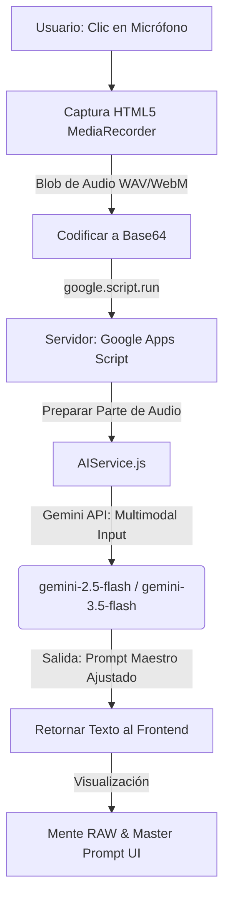

# Especificación Técnica y Plan de Diseño - Refinamiento Asistido por Voz (Audio-to-Prompt)

Este documento detalla la planificación y la arquitectura para la futura implementación de la tecnología de entrada por voz en el Laboratorio de IA y ERP. Permite a los diseñadores comerciales y operadores dictar instrucciones de refinamiento visual de forma natural y manos libres.

---

## 1. Arquitectura de Flujo de Datos



---

## 2. Especificación Técnica de Implementación

### A. Frontend (Captura y Codificación)

En el navegador del usuario (dentro de `ai_lab.html`), utilizaremos la API nativa de JavaScript `MediaRecorder` para capturar el audio desde el micrófono en un formato comprimido ligero (WAV o WebM).

1. **Inicialización y Grabación:**
   ```javascript
   let mediaRecorder;
   let audioChunks = [];

   async function iniciarGrabacionVoz() {
     const stream = await navigator.mediaDevices.getUserMedia({ audio: true });
     mediaRecorder = new MediaRecorder(stream);
     audioChunks = [];

     mediaRecorder.ondataavailable = event => {
       audioChunks.push(event.data);
     };

     mediaRecorder.onstop = async () => {
       const audioBlob = new Blob(audioChunks, { type: 'audio/webm' });
       const base64Audio = await convertirBlobABase64(audioBlob);
       enviarAudioAlServidor(base64Audio);
     };

     mediaRecorder.start();
   }
   ```

2. **Conversión a Base64:**
   ```javascript
   function convertirBlobABase64(blob) {
     return new Promise((resolve, reject) => {
       const reader = new FileReader();
       reader.onloadend = () => {
         // Extraer los datos puros en base64 de la URL de datos
         const base64Data = reader.result.split(',')[1];
         resolve(base64Data);
       };
       reader.onerror = reject;
       reader.readAsDataURL(blob);
     });
   }
   ```

### B. Backend (Procesamiento Multimodal con Gemini)

En el archivo `src/Services/AIService.js`, implementaremos una nueva función operativa que reciba la cadena en Base64, construya la parte de audio del payload de Gemini y llame al modelo conversacional multimodal (`gemini-2.5-flash` o `gemini-3.5-flash`), que posee soporte de audio nativo de fábrica.

* **Ejemplo de Payload de Gemini con Entrada de Audio:**
  ```json
  {
    "contents": [
      {
        "parts": [
          {
            "text": "Analiza las instrucciones habladas por el usuario y aplícalas al siguiente Prompt Maestro. Retorna únicamente el Prompt Maestro modificado en inglés, respetando el formato estricto de directivas estéticas de catálogo. \n\n[PROMPT MAESTRO ACTUAL]: \nHigh-end studio photography of a folded garment..."
          },
          {
            "inlineData": {
              "mimeType": "audio/webm",
              "data": "[BASE64_AUDIO_DATA_FROM_FRONTEND]"
            }
          }
        ]
      }
    ],
    "generationConfig": {
      "temperature": 0.3
    }
  }
  ```

---

## 3. Estrategia de Fusión Semántica (El Prompter por Voz)

La IA no solo actuará como un transcriptor clásico (Speech-to-Text). Su rol será **interpretativo y adaptativo**:

1. **Traducción e Interpretación:** Si el usuario dice *"ponerle una iluminación más dramática con sombras suaves y cambiar el fondo a madera oscura"*, Gemini interpretará estos conceptos estéticos y los traducirá a terminología técnica de fotografía de estudio en inglés en el prompt final (ej. *"cinematic low-key lighting, soft professional shadow falloff, dark textured oak wood surface"*).
2. **Preservación de Identidad:** El modelo se asegurará de que el dictado del usuario no afecte negativamente las reglas fijas de la prenda (color, costuras, logotipos) extraídas previamente por la ficha forense, garantizando la consistencia estructural.

---

## 4. UI/UX Propuesta para el Laboratorio

* **Botón de Micrófono Premium:** Un botón de control flotante en el modal de refinamientos con diseño dinámico.
* **Efecto de Grabación:** Al pulsar el botón, mostrar una micro-animación de ondas de audio vibrantes (SVG/CSS) en color púrpura y un temporizador que limita la grabación a un máximo de 15 segundos para optimizar la velocidad.
* **Procesamiento Silencioso:** Un spinner dinámico que muestre *"Escuchando y rediseñando prompt..."* mientras la IA procesa el refinamiento semántico.
