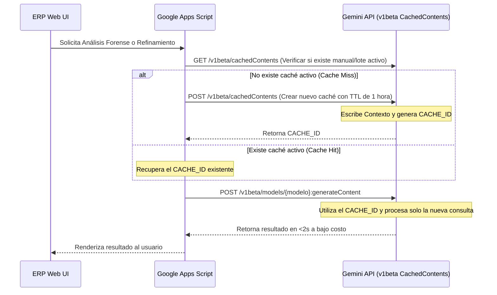

# 🧠 Fase 3: Context Caching Condicional (Planificación Futura)

Este documento detalla el diseño, arquitectura, implicaciones de costos y estrategia de implementación para la **Fase 3: Pipeline de Context Caching Condicional** en el ERP de Skypia Underwear.

---

## 📋 1. Visión General & Propósito

Cuando se auditan imágenes en el laboratorio de IA o se realizan refinamientos en las fichas técnicas, el sistema interactúa continuamente enviando imágenes de alta resolución (2560px optimizadas) y directivas extensas.
Normalmente, cada refinamiento o consulta posterior sobre un producto requiere volver a subir todo el contexto visual pesado y las directivas globales.

La **Fase 3** propone almacenar en caché temporalmente este contexto visual pesado e instrucciones maestras en los servidores de Google Gemini.

### Beneficios clave:
* ⚡ **Velocidad Ultra-Rápida:** Respuestas en menos de 2 segundos en refinamientos complejos.
* 💰 **Ahorro Masivo:** Reducción de costos del **75% al 90%** en tokens de lectura/entrada en consultas repetidas.
* 🛡️ **Prevención de Exceso de Cuota:** Reduce significativamente el tráfico de red de subida en Google Apps Script, evitando timeouts de ejecución.

---

## 💸 2. Análisis Detallado de Costos y Rentabilidad

El Context Caching de la API de Gemini tiene reglas de facturación sumamente específicas que deben gestionarse de manera inteligente.

### 2.1 Estructura de Precios en Gemini API (Vertex AI / Google AI Studio)

| Concepto | Costo / Condición | Explicación |
| :--- | :--- | :--- |
| **Escritura (Creación)** | Tarifa Estándar de Entrada | Se procesa el contexto la primera vez y se escribe en caché. |
| **Almacenamiento (Storage)** | ~ **$1.00 USD** / Mtokens / hora (Pro)<br>~ **$0.25 USD** / Mtokens / hora (Flash) | Cargo prorrateado por segundo basado en el TTL (Tiempo de Vida) configurado. |
| **Lectura (Cache Hits)** | **75% a 90% de Descuento** | En lugar de pagar $1.25 / Mtokens en Pro, pagas solo **$0.3125 / Mtokens**. |

### 2.2 La Restricción del Umbral Mínimo (32,768 Tokens)

> [!IMPORTANT]
> **Google Gemini impone un límite mínimo de 32,768 tokens (32k) para poder activar Context Caching.**
> Si intentas crear una caché para un contexto que mide menos de 32k tokens, la API rechazará la creación del caché o no la tomará en cuenta.

#### ¿Cuántos tokens consume nuestro flujo habitual?
* **1 Imagen Máster Optimizada (sz=2560):** ~ 258 a 1,500 tokens (dependiendo de la codificación y modelo).
* **Ficha Técnica & Directivas de Arte:** ~ 2,000 a 4,000 tokens de texto.
* **Total por consulta estándar:** ~ 3,500 a 5,500 tokens.
* **Resultado:** Una sola imagen individual **está muy por debajo del umbral mínimo de 32k tokens** y no es apta para caching individual directo.

---

## 🎯 3. Estrategias de Implementación para el ERP

Para hacer viable y rentable el uso de Context Caching, aplicaremos dos estrategias específicas:

### Estrategia A: El "Manual de Estilo Visual Maestro" (Global Caching)
Crear un archivo caché persistente (duración de 1 a 4 horas) que actúe como ancla para todas las llamadas del laboratorio.
* **Qué incluye:**
  * Las directivas completas de Art Director en inglés.
  * El catálogo oficial de colores HEX, materiales autorizados y restricciones de marca.
  * 15 a 20 imágenes de muestra/referencia que representen perfectamente la línea de diseño de Skypia Underwear.
* **Total de tokens:** ~ 45,000 a 65,000 tokens (supera el umbral de 32k).
* **Rentabilidad:** Cada vez que el usuario use el laboratorio durante el día para analizar nuevos productos, la llamada hará un "Cache Hit" parcial en ese manual maestro, obteniendo un descuento directo en el 90% del prompt base del sistema.

### Estrategia B: Caching de Lotes de Producto (Multi-ángulo)
Cuando se suben de golpe múltiples ángulos y costuras de un mismo artículo para ser refinados.
* **Qué incluye:**
  * 10 o más imágenes detalladas del mismo SKU.
  * Prompt del sistema del Art Director.
* **Total de tokens:** ~ 35,000 a 50,000 tokens.
* **Rentabilidad:** Excelente cuando el usuario edita interactivamente el mismo producto desde el dashboard y ejecuta pruebas de render / descripción múltiple en un periodo corto de tiempo.

---

## 🛠️ 4. Arquitectura Técnica de la Fase 3

El ciclo de vida en Google Apps Script para implementar esta lógica se divide en tres pasos:



### 1. Creación del Caché (`POST /v1beta/cachedContents`)
```bash
curl -X POST "https://generativelanguage.googleapis.com/v1beta/cachedContents?key=${API_KEY}" \
-H 'Content-Type: application/json' \
-d '{
  "model": "models/gemini-1.5-pro-002",
  "contents": [ ...contenido pesado/imágenes... ],
  "ttl": "3600s",
  "displayName": "skypia_master_manual"
}'
```

### 2. Consulta referenciando la Caché (`generateContent`)
```bash
curl -X POST "https://generativelanguage.googleapis.com/v1beta/models/gemini-1.5-pro-002:generateContent?key=${API_KEY}" \
-H 'Content-Type: application/json' \
-d '{
  "contents": [
    { "parts": [{ "text": "Audita la nueva imagen basándote en el manual maestro en caché." }] }
  ],
  "cachedContent": "cachedContents/skypia_master_manual_id"
}'
```

---

## 📅 5. Conclusión y Próximos Pasos

El Context Caching es una herramienta de ingeniería de primer nivel que garantiza **rapidez extrema y ahorro financiero**, siempre y cuando consolidemos contextos de gran volumen (>32k tokens). 

Este plan queda guardado para el momento en el que el volumen de uso del laboratorio o las directivas fotográficas del ERP justifiquen su implementación comercial.
