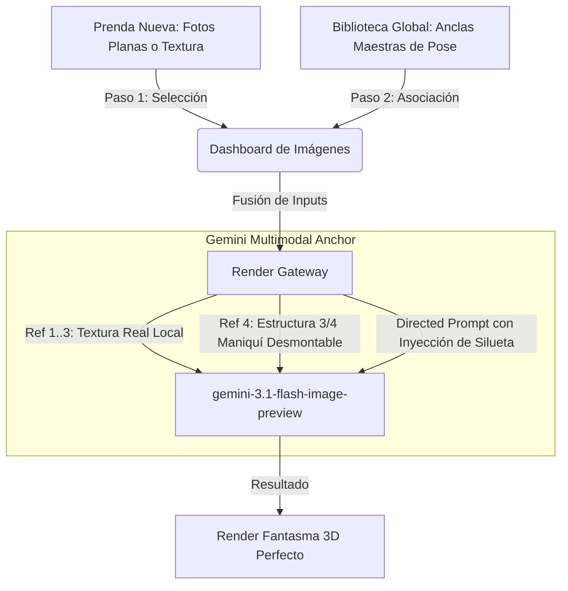

# 🏛️ Anclas Maestras de Pose Visual y Entrenamiento por Categoría (Phase-5 Premium)

Propuesta de diseño técnico para centralizar la biblioteca de poses físicas tridimensionales (efecto Maniquí Invisible y ángulos 3D) tomadas manualmente con maniquí desmontable, integrándolas como referencias de estructura estricta en el motor de renderizado multimodal de Gemini.

---

## 💡 El Concepto Central

Actualmente, el sistema deriva ángulos buscando imágenes de referencia dentro de la misma carpeta del producto. Si no existen fotos de la espalda o de perfil, la IA debe inferir (imaginar) los detalles de costura y caída.

Esta propuesta introduce el concepto de **Anclas Maestras de Estructura (Master Poses Library)**:
1. **Biblioteca Centralizada**: El usuario almacena una colección de fotos maestras físicas de alta calidad (como las tomas de maniquí desmontable en $3/4$, frente y espalda) en un directorio global de Google Drive.
2. **Clasificación por Categoría de Prenda**: Las anclas se organizan por categoría (*Chaqueta de Cierre*, *Suéter Cerrado*, *Cárdigan con Botones*, *Pantalón Cargo*, etc.).
3. **Pivote Estructural Multimodal**: Al generar un nuevo render o derivar un ángulo, el sistema fusiona:
   - **Textura y Detalles de Diseño**: Desde las fotos físicas del producto local (ej: retazos de tela, fotos planas de la mesa).
   - **Volumen, Caída y Anatomía (Pose)**: Desde la **Ancla Maestra** de la categoría seleccionada.

---

## 🗺️ Flujo de Renderizado Propuesto

---

## 🛠️ Diseño de la Base de Datos e Interfaz

### 1. Extensión de Base de Datos (`PRODUCT_IMAGES` o Tabla Auxiliar)
Se propone crear una hoja de configuración llamada `CONFIG_MASTER_POSES` para registrar las imágenes de referencia estructural:

| CATEGORIA_ID | NOMBRE_POSE | ARCHIVO_DRIVE_ID | ANGULO | DESCRIPCION_PROMPT_ESTRUCTURAL |
| :--- | :--- | :--- | :--- | :--- |
| `SUETER_CERRADO` | `Classic 3/4 Ghost` | `FILE_ID_1` | `Vista Lateral Semi-Frontal (3/4)` | `Ghost mannequin, 3D volumetric shape of a crewneck sweater, hollow neck depth...` |
| `CHAQUETA_ZIP` | `Frontal Zip Open` | `FILE_ID_2` | `Vista Frontal (Front View)` | `Ghost mannequin effect, zip-up jacket slightly open at the top, showing inner collar...` |

### 2. Integración en el Dashboard de Imágenes
* **Selector de Silueta**: En el modal de edición de imagen, al lado de la derivación de ángulos, se añade un control:
  > *"Aplicar Plantilla de Caída y Volumen (Silueta)"* → [Desplegable con las anclas maestras de la categoría].
* **Previsualización Visual**: Un pequeño thumbnail al lado del selector mostrará la foto física del maniquí desmontable que se usará como molde estructural.

---

## 🔄 Integración con Capturas 360° (Object2VR)

Dado que cuentas con secuencias fotográficas en 360° o videos giratorios generados con Object2VR, la biblioteca de anclas puede evolucionar a **Anclas de Animación Estructural**:

1. **Frames Clave (Keyframes)**: Se extraen 4 u 8 fotogramas equidistantes del giro 360° de tu maniquí desmontable (Frente, 3/4 Izquierda, Perfil Izquierdo, Espalda, Perfil Derecho, 3/4 Derecha).
2. **Generación Secuencial de Rotación**:
   - Cuando agregas una nueva tela o diseño de suéter, el sistema ejecuta un bucle de renderizado en el *Render-Gateway*.
   - Renderiza secuencialmente cada uno de los keyframes usando la correspondiente ancla maestra de pose.
   - **Resultado**: El sistema genera automáticamente una secuencia de 8 fotos perfectamente alineadas en rotación, listas para ser compiladas en un nuevo archivo interactivo 360° sin necesidad de volver a fotografiar físicamente el maniquí.

---

## 📝 Beneficios de esta Implementación

> [!TIP]
> **Consistencia de Marca Inigualable**
> Al usar la misma foto de pose física como "molde" estructural para todos tus suéteres o pantalones, tu catálogo web se verá 100% simétrico, uniforme y limpio, logrando la estética de marcas internacionales de alta costura.

> [!NOTE]
> **Ahorro Masivo de Tiempo**
> Tomas la foto de la pose física perfecta de tu maniquí desmontable una sola vez. A partir de ahí, puedes renderizar 100 diseños de telas diferentes en esa misma pose impecable de 3/4 sin tocar una sola cámara o software de edición.

---

## 📌 Próximos Pasos para su Implementación

1. **Recopilación**: Buscar y seleccionar en tu directorio principal de Drive las fotos maestras físicas en $3/4$, Frente y Espalda que mejor definan cada categoría.
2. **Estructuración**: Crear la carpeta global `Master Poses ERP` y guardar allí estas fotos con nombres estandarizados (ej: `pose_sueter_3_4.png`, `pose_sueter_back.png`).
3. **Automatización de Código**: 
   - Modificar `Images.js` para que si se selecciona una silueta maestra, jale ese `ARCHIVO_DRIVE_ID` como la referencia visual primaria (`refIds[0]`) y use su descripción en el Prompt como guía anatómica.
