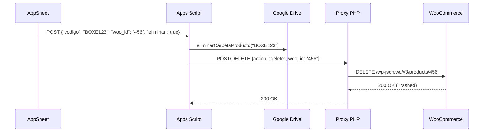

# Fase Futura: Eliminación Sincronizada en WooCommerce

## Descripción
Actualmente, cuando se elimina un producto en AppSheet, la automatización borra la fila en Google Sheets y, gracias a la última actualización, busca y elimina la carpeta de imágenes asociada en Google Drive. Sin embargo, el producto **sigue existiendo en la tienda WooCommerce**, lo que genera productos huérfanos/privados.

## Objetivo
El objetivo para esta futura fase es que la eliminación en AppSheet también dispare una solicitud a la API de WooCommerce para eliminar (o enviar a la papelera) el producto en la tienda online.

## Lógica Proyectada

1. **Retención del WOO_ID:**
   - Dado que AppSheet elimina la fila *antes* de que Apps Script ejecute el webhook final, Apps Script pierde acceso al `WOO_ID` almacenado en esa fila.
   - **Solución A:** Que AppSheet envíe el `WOO_ID` como un campo en el payload JSON del webhook de eliminación.
   - **Solución B:** Crear una tabla o caché temporal de logs de eliminación para que Apps Script pueda consultar qué `WOO_ID` pertenecía al `CODIGO_ID` (SKU) recién borrado.

2. **Nuevo Endpoint en el Proxy PHP (`api-woocommerce-product.php`):**
   - El archivo PHP que hace de intermediario en Donweb necesitará manejar solicitudes HTTP `DELETE`.
   - Recibirá el `woo_id` y usará la SDK o Endpoints nativos REST de WooCommerce (`DELETE /wp-json/wc/v3/products/<woo_id>`).

3. **Modificación en Apps Script (`Main.js` / `WoocommerceProduct.js`):**
   - Cuando ingrese el webhook `{"codigo": "...", "woo_id": "...", "eliminar": true}`, Apps Script llamará a una nueva función `eliminarProductoWP(wooId)`.
   - Esta función enviará un payload al proxy PHP para ejecutar el borrado.
   - Se ejecutará en paralelo (o secuencialmente) a `eliminarCarpetaProducto(sku)`.

## Flujo Ideal Futuro

